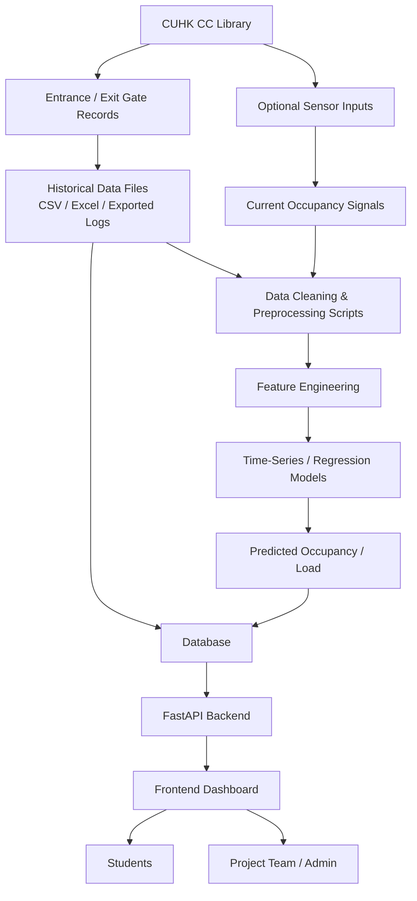

# CUHK CC Library Occupancy Forecasting Platform (GECC4130-Library-Seat-Occupancy-SaaS)

A course project for **GECC4130 Senior Seminar** focused on the CUHK Chung Chi College Elisabeth Luce Moore Library. This project studies study-space usage patterns, estimates occupancy from entrance and exit flow data, and presents historical and predicted library load through an interactive web platform.[1]

## Project Overview

The project investigates how library entrance and exit records can be transformed into occupancy-related time-series data for analysis and short-term forecasting.[2][1]
The intended outcome is a student-facing dashboard that visualizes historical usage and provides practical guidance on lower-load study periods or spaces.[2][1]

## Objectives

- Analyze historical entrance and exit flow patterns at the CUHK CC Library.[2]
- Estimate real-time or interval-based occupancy from access-flow data.[2][1]
- Build baseline statistical forecasting models, including time-series and regression-style approaches.[1][3]
- Deliver an interactive website that integrates database storage, backend APIs, and frontend visualization.[4][5]

## Scope

The current project scope is centered on the CUHK Chung Chi College library rather than a campus-wide multi-library deployment.[1]
Historical aggregated data is the preferred training source, while optional sensor input can support current occupancy estimation or validation.[2]
For a course-project prototype, periodic CSV or exported records are more realistic than requiring a live institutional API from the start.[2]

## System Flow



The workflow starts from access-control records and optional live signals, then moves through preprocessing, modeling, storage, API delivery, and dashboard display.[2][4][6]
This structure matches the project direction discussed earlier: data collection, statistical analysis, forecasting, and website delivery in one integrated system.[6][3]

## Tech Stack

| Layer | Recommended Stack | Purpose |
|---|---|---|
| Frontend | HTML, CSS, JavaScript | Dashboard UI, charts, occupancy display, user interaction.[4][5] |
| Backend | Python, FastAPI | REST API, prediction endpoints, data handling, server-side logic.[5] |
| Database | PostgreSQL | Store historical records, processed features, and prediction outputs.[5] |
| Data Processing | Python scripts | Cleaning, aggregation, feature generation, scheduled import jobs.[7][5] |
| Modeling | Time-series analysis, regression models | Baseline occupancy and demand forecasting.[1][3] |
| Visualization | JavaScript charts / dashboard components | Show trends, forecasts, and occupancy summaries.[1][5] |
| Version Control | Git, GitHub | Team collaboration and repository management.[1] |

## Hardware and Infrastructure

The project can be prototyped on a single server machine that hosts frontend files, backend services, scripts, models, and the database service together.[4][7]
This setup is suitable for a course project because it is simpler to deploy, easier to demo, and does not require a distributed production environment.[7][4]

### Core Components

- Client devices: laptops or mobile browsers used by students to view the dashboard.[6]
- Library access-control system: source of entrance and exit flow data.[2]
- Optional sensors: supplementary current-occupancy signal or validation input.[2]
- Server machine: runs frontend assets, FastAPI backend, scheduled scripts, and model logic.[7][4]
- Database server or database service: stores records, processed data, and prediction results.[7][5]

## Suggested Repository Structure

```text
project-study-space/
├── README.md
├── .env
├── .gitignore
├── requirements.txt
├── frontend/
│   ├── dashboard.html
│   ├── admin.html
│   ├── styles.css
│   ├── app.js
│   ├── admin.js
│   └── assets/
├── backend/
│   ├── main.py
│   ├── dependencies.py
│   ├── database.py
│   ├── routers/
│   ├── models/
│   ├── schemas/
│   └── services/
├── scripts/
│   ├── clean_data.py
│   ├── build_features.py
│   ├── train_model.py
│   └── predict.py
├── model/
│   ├── occupancy_model.pkl
│   ├── metadata.json
│   └── feature_list.json
├── data/
│   ├── raw/
│   ├── processed/
│   └── external/
└── logs/
    ├── ingestion.log
    └── prediction.log
```

This layout reflects the earlier system design where frontend, backend, model files, and data-related scripts all live on the same server machine in separate folders.[7][4][5]
The `scripts/` folder is best used for data-processing and model-related scripts, while request-handling web logic belongs under `backend/`.[5]

## Data Pipeline

1. Collect anonymized and aggregated historical entrance/exit records from the library.[2]
2. Clean and aggregate records into fixed intervals such as 5-minute, 15-minute, or hourly buckets.[2][1]
3. Derive features such as hour of day, day of week, exam period, entry count, exit count, and lagged occupancy indicators.[1]
4. Train baseline forecasting models and evaluate them with standard error metrics.[1]
5. Store processed data and predictions in the database, then expose them through API endpoints for the dashboard.[4][5]

## Modeling Notes

The project previously considered using around 6 to 8 predictors as a practical starting point for a baseline model.[7]
A simple first version can use linear regression or time-series regression before moving to more advanced forecasting methods.[7]
For the course context, the model should remain interpretable and clearly connected to the observed library usage problem.[1]

## Roles and Workstreams

The project work was previously discussed in several parts: data collection, statistical analysis, website development, and presentation/reporting.[3]
A reasonable split is to assign website implementation to the web-development role, while modeling and data analysis are handled by teammates focusing on statistics or forecasting components.[3]

## Future Extensions

Possible future improvements include live data ingestion, zone-level occupancy prediction, better map-based visualization, and richer validation using sensor data.[2][6]
If institutional support becomes available later, a scheduled feed or API can replace manual CSV import for near-real-time updates.[2]


## Acknowledgment

This repository documents a GECC4130 Senior Seminar project that integrates data collection, statistical modeling, and web-system development into a practical study-space forecasting platform for the CUHK CC Library.[1]
